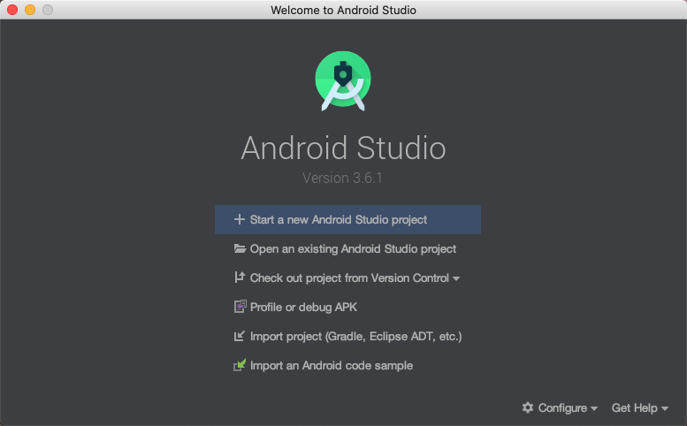
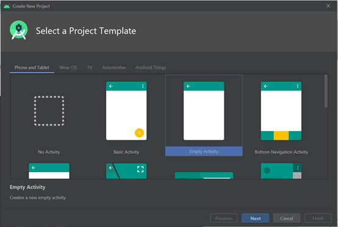
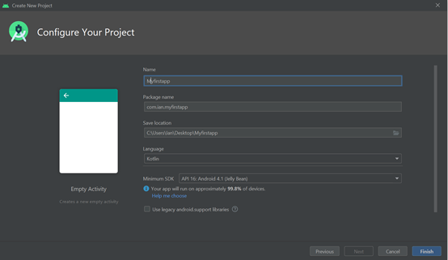

## Create an Android project(建立一個Android專案)

<!--more-->

## 要建立新的Android專案，請按照以下步驟操作

### 1. 安裝最新版本的 Android Studio

   [Download Android Studio and SDK tools  |  Android Developers](https://developer.android.com/studio/)

   下載完後點選安裝一路安裝到結束。

### 2. 開啟新專案(cerate new project )

在**Welcome to Android Studio**視窗中，單擊啟動新的**Strat a new Android Studio project**。

### 3. 選擇模板

在**Select a Project Template**視窗中，選擇**Empty Activity**，然後單擊**next**。

### 4. 設定專案配置

在**Configure Your Project**視窗中，完成以下操作：

- 在**Name**輸入 "Myfirstapp" 。
- 在**Package name**欄位中輸入"com.example.myfirstapp" 。
- `Save Location` 預設專案放置位置，如果要將專案放置在其他資料夾中，請更改其**儲存**位置。
- 從`Language`下拉選單中選擇**Java**或**Kotlin**。
- 在`Minimum SDK`選擇您的應用將支援的**最低** Android版本。
- 保留其他選項不變。

### 5 .**完成專案建置**

經過一段時間的處理後，出現Android Studio主視窗。

Android Studio主視窗

現在花點時間檢視最重要的檔案。

首先，請確保已開啟專案視窗`> Java> com.example.myfirstapp> MainActivity`（選擇"檢視>工具視窗>專案），並且從該視窗頂部的下拉列表中選擇了Android檢視。

- Activity

這是主要活動。這是您的應用程式的切入點。在構建和執行應用程式時，系統將啟動該應用程式的例項 [Activity](https://developer.android.com/reference/android/app/Activity) 並載入其佈局。

應用程式> res>佈局> activity_main.xml

此XML檔案定義活動的使用者介面（UI）的佈局。它包含一個[TextView](https://developer.android.com/reference/android/widget/TextView)帶有文字" Hello，World！" 的 元素。

- **AndroidManifest.xml > 應用清單**

該[清單檔案](https://developer.android.com/guide/topics/manifest/manifest-intro)描述了應用程式的基本特徵，並限定它的每一個元件。

- **build.gradle  > Gradle 指令碼**

有兩個名稱相同的檔案：一個用於專案" Project：My First App"，另一個用於應用程式模組" Module：app"。每個模組都有自己的build.gradle檔案，但是該專案當前只有一個模組。使用每個模組build.file來控制[Gradle外掛](https://developer.android.com/studio/releases/gradle-plugin)如何構建您的應用程式。有關此檔案的更多資訊，請參見 [配置構建]([Configure your build | Android Developers](https://developer.android.com/studio/build#module-level))。

## 參考
[Create an Android project | Android Developers](https://developer.android.com/training/basics/firstapp/creating-project)

