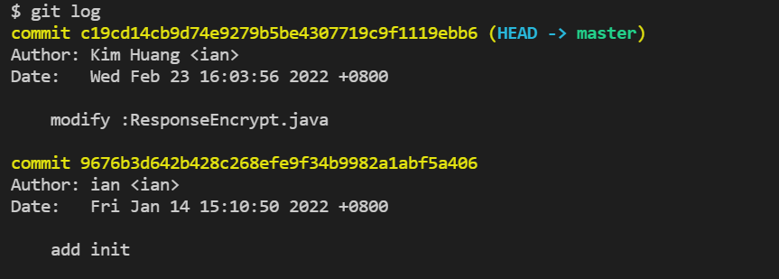
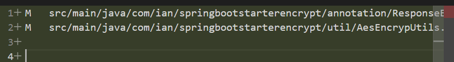

## GIT 匯出差異檔案
<!-- 簡介 -->
<!--more-->

## 前言

在一般的時候我們會需要匯出程式差異清單來交付

## 目的

- 產生差異清單
- 匯出差異檔案(含完整目錄)

## **產生差異清單**

```bash
git diff-tree -r --no-commit-id --name-status --text --diff-filter=ACDMRT  commit-id-1 commit-id-2 > changes.txt
```

**參數說明**

- diff-tree                 : 比較兩個 commit 之間的差異。
- r                             : 列出完整路徑。
- name-status          :  顯示檔案名稱和檔案的變更狀態
- diff-filter=ACMRT : 列出指定類型檔案**[(A|C|D|M|R|T|U|X|B)…[*]]**。
    - A - Added
    - C - Copied
    - D - Deleted
    - M - Modified
    - R - Renamed
    - T - have their type (mode) changed
    - U - Unmerged
    - X - Unknown
    - B - have had their pairing Broken
    - - All-or-none 的檔案

### **範例 :**

先用git log 找出差異ID

 `git log`

 


```bash
git diff-tree -r --no-commit-id  --name-status --text --diff-filter=ACDMRT  c19c 9676 > differences.txt
```

**差異如下**


## 匯出差異檔

```bash
git archive --format=zip --output=files.zip HEAD $(git diff-tree -r --no-commit-id --name-only --diff-filter=ACMRT commit-id-1 commit-id-2)
```

⚠️ 若沒加 `$(git diff-tree -r — no-commit-id — name-only— diff-filter=ACMRT HEAD)`則會包到整個專案的檔案

### **範例 :**

```bash
git archive --format=zip --output=files.zip HEAD $(git diff-tree -r --no-commit-id --name-only --diff-filter=ACMRT c19c 9676)
```

### sh匯出檔案

**exportDifferences.sh**

```bash
#!/bin/sh
 
# TODAY=`date '+%Y-%m-%d %H:%M:%S'`
TODAY=`date '+%Y-%m-%d'`

name=files_"$TODAY"

echo "$name"

git archive --format=zip --output="$name".zip HEAD $(git diff-tree -r --no-commit-id --name-only --diff-filter=ACMRT c19c 9676)
```

## **Summary**

透過 git 內建指令我們可以簡單的 匯出差異檔案 及 差異清單 

## 參考 :

[匯出 Git Commit 檔案並維持資料夾結構-黑暗執行緒 (darkthread.net)](https://blog.darkthread.net/blog/export-git-commit-files/)

[GIT 查看/匯出差異檔案 - LinYoYo_攻城獅_學習筆記 (hank7891.github.io)](https://hank7891.github.io/2021/08/11/GIT%E6%9F%A5%E7%9C%8B:%E5%8C%AF%E5%87%BA%E5%B7%AE%E7%95%B0%E6%AA%94%E6%A1%88/)

[git 匯出差異清單和檔案. 匯出特定版本中新增或修改過的檔案 | by Jingle Lin | Jiingler | Medium](https://medium.com/jiingler/git-%E5%8C%AF%E5%87%BA%E5%B7%AE%E7%95%B0%E6%B8%85%E5%96%AE%E5%92%8C%E6%AA%94%E6%A1%88-42b6ab9c7594)


