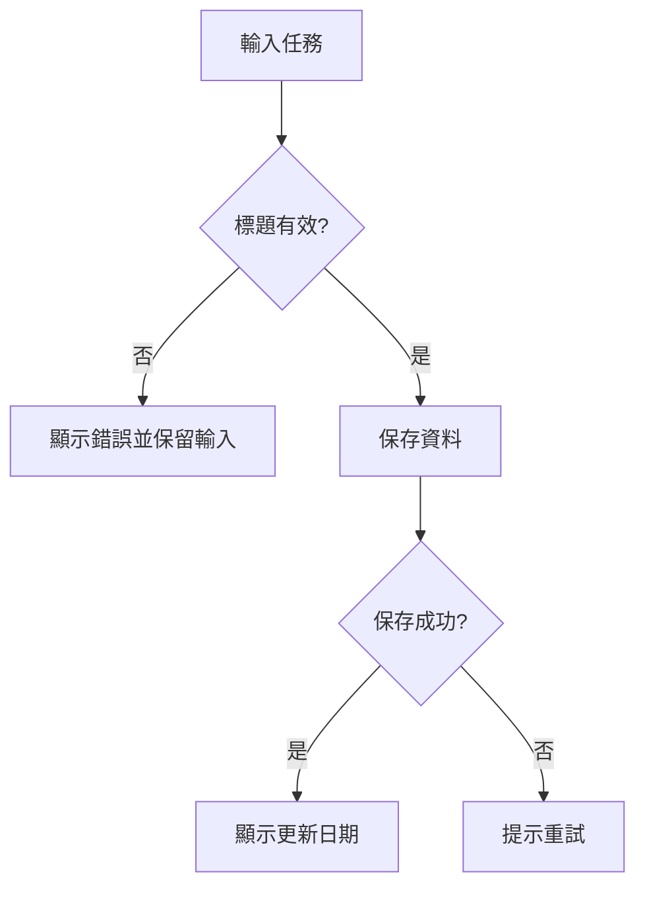

補上可修改的流程圖範例、匯出方式與用途比較，不再只留下外部分享網址。

<!--more-->

適用：設計討論與檔案中的流程／時序圖。本站目前以程式碼顯示Mermaid，未啟用執行時renderer。

## 文字圖示例

把此段複製到[Mermaid Live Editor](https://mermaid.live/)，應看到有效／無效、成功／失敗兩組分支，可匯出SVG／PNG。原分享連結的壓縮圖內容不能取代repo內可維護的來源。

## 工具取捨

Mermaid適合Git diff、簡單流程與時序，複雜佈局可能難精細控制；diagrams.net適合拖拉與自由排版，儲存可編輯來源而不是只有截圖。白板用於討論快稿，定稿後寫清楚符號與輸入輸出。

時序圖用於誰先呼叫誰，flowchart表示決策流程，ER圖表示資料關係，不是所有圖都叫流程圖。每個分支儘量有條件，錯誤與取消也畫出來；不要用巨大圖掩蓋沒決定的業務規則。

## 驗證與匯出

用實際案例沿箭頭走一遍，確認沒有無出口節點與遺漏錯誤路徑。圖中文字在手機與匯出後仍可讀，提供旁邊文字說明與可追溯版本。外部Live Editor分享可能包含敏感系統資訊，不上傳秘密／內網地址；在授權環境處理相關資料。

若以後在Hugo加入Mermaid renderer，先選擇固定版本、評估CSP與不可信圖輸入，不能只開放unsafe執行任意HTML。

## 查核範圍

官方文件／原廠入口與規格查核，程式碼和內部連結完成靜態檢查；需特定平台、帳號、服務或叢集的步驟未實機執行，文內列出讀者確認方式。詳細紀錄見[逐篇查核紀錄]()。

## 參考資料

- [Mermaid flowchart](https://mermaid.js.org/syntax/flowchart.html)
- [Mermaid Live](https://mermaid.live/)
- [diagrams.net](https://www.drawio.com/docs/)

### 原始筆記保留的來源

- [Online FlowChart & Diagrams Editor - Mermaid Live Editor](https://mermaid.live/edit#pako:eNp1kltPgzAUx79K0xdfdiljF2h0RjNd9HGbMTG8NHDGGqHFtkTnsu9uKbBL5iAh9H_O738u6Q7HMgFMsYavEkQMM85SxfJIIPsUTBke84IJg56VFAZEchl5ZPHnv4GH0mzIpTyXMs0gEnWk9e1Op40RRfOnFepnMuWinzbJVWoTt5nOmaKlPWmkqta1Qd_cbBpz5GAkC8NlU8chFq0TKFpAwhXERqM3DQoZeY4WLIWLBlvWEWBVpVsqVpBYhbNM11itH3tdgCmVqKvdHLCXma1sh7rWo5usaZGLtVQ5q0ZCpeYiPUWvlWu7P6XPix22Xm_Tyej1fXXqftx860eRTwaor8F0Xd69-97dWnBaEbiDc7D1eGIv165yibDZQA4RpvY3gTUrMxPhSOxtKiuNXG5FjKlRJXRwWSTMtHexFe3l-ZDy9IjpDv9g6hHS871xYF9_MgzHw6CDt1YOhr3A84NgNPI8j4SDwb6Df50D6YW-Nwk9nxCfjCbhKNz_AZyq_-w)
